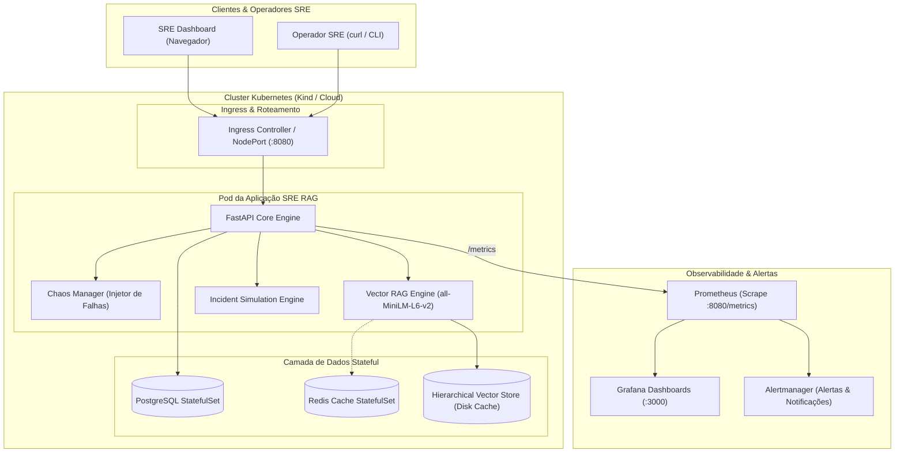
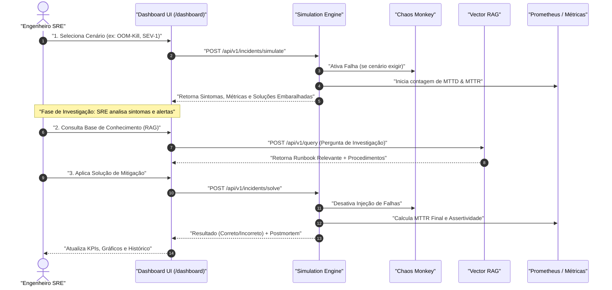
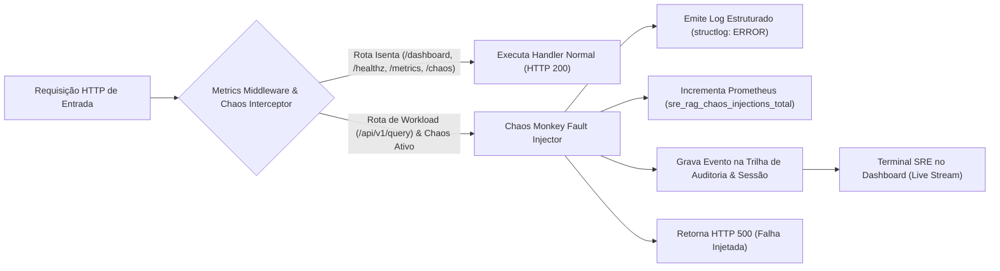
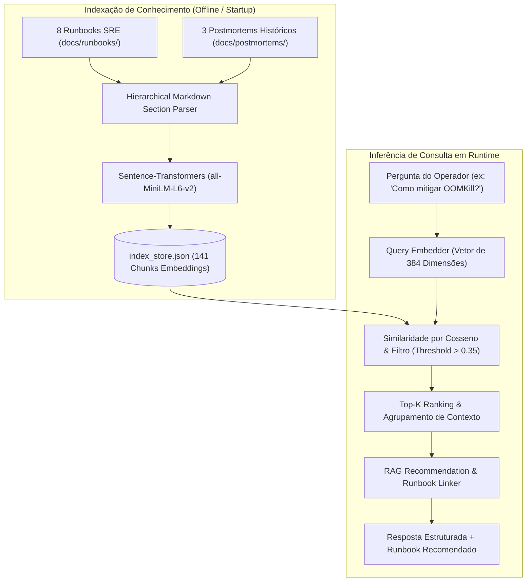
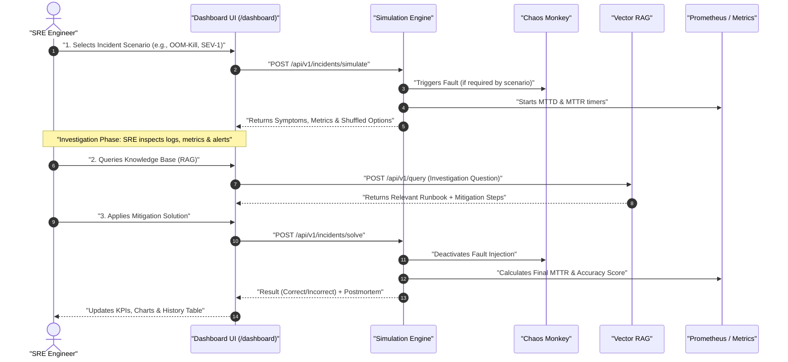
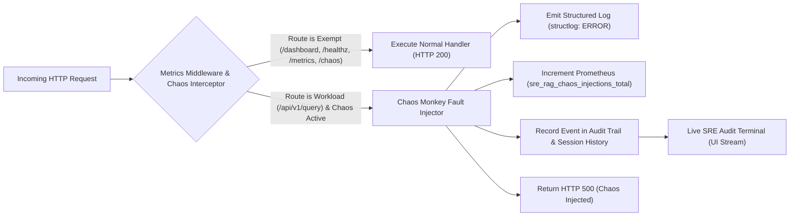
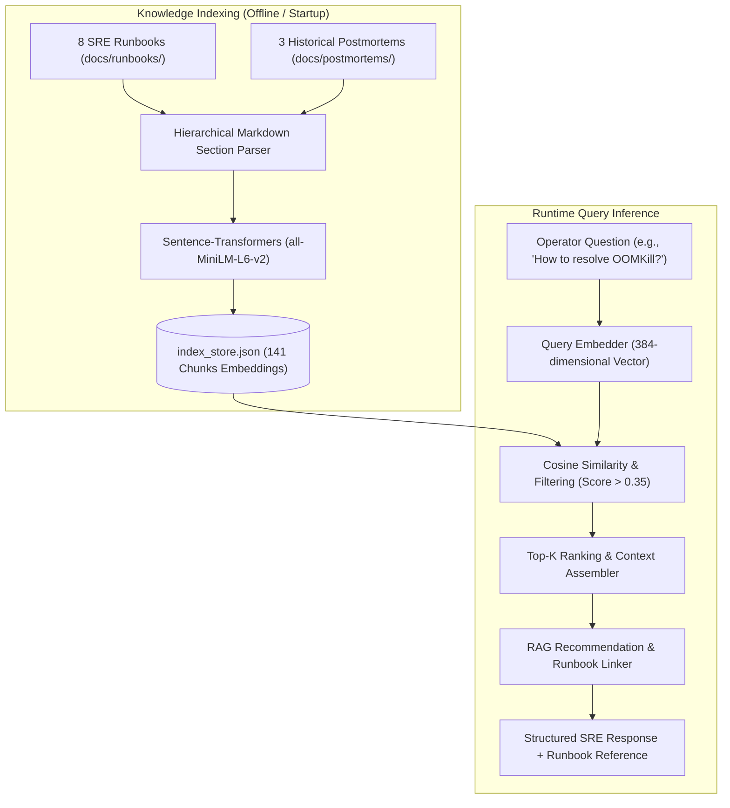

# 🚨 SRE RAG Agent — Incident Simulation Lab & Observability Platform

[ 🇧🇷 Ler em Português ](#-versão-em-português) &nbsp;|&nbsp; [ 🇺🇸 Read in English ](#-english-version)

---

<a id="-versão-em-português"></a>
## 🇧🇷 Versão em Português

<p align="center">
  
    
  
  
  
  
  
</p>

> **Ambiente Completo de Prática e Engenharia de Confiabilidade (SRE)**: Simulação interativa de incidentes em Kubernetes, motor de busca vetorial RAG (*Retrieval-Augmented Generation*) para Runbooks, injeção de falhas com **Chaos Monkey**, auditoria em tempo real, framework de avaliação de IA e observabilidade ponta a ponta com Prometheus e Grafana.

---

## 📑 Sumário

- [Visão Geral & Novas Features](#-visão-geral--novas-features)
- [Arquitetura do Sistema](#-arquitetura-do-sistema)
- [Fluxo de Resposta a Incidentes (MTTD & MTTR)](#-fluxo-de-resposta-a-incidentes-mttd--mttr)
- [Chaos Monkey & Trilha de Auditoria](#-chaos-monkey--trilha-de-auditoria)
- [Motor de Busca Vetorial RAG](#-motor-de-busca-vetorial-rag)
- [Framework de Avaliação SRE](#-framework-de-avaliação-sre)
- [Estrutura do Repositório](#-estrutura-do-repositório)
- [Guia Rápido (Quick Start)](#-guia-rápido-quick-start)
- [SLIs, SLOs & Observabilidade](#-slis-slos--observabilidade)
- [Segurança & Ambientes](#-segurança--ambientes)
- [Autor & Licença](#-autor--licença)

---

## 🌟 Visão Geral & Novas Features

Este projeto evoluiu de um protótipo para um **Laboratório de Engenharia SRE de Padrão Google**:

1. **🎯 Painel Interativo de Simulação de Incidentes (`/dashboard`)**:
   - 8 cenários realistas de falha em Kubernetes (OOM-Kill, CrashLoopBackOff, Degradação TLS, Esgotamento Redis, Pressão de Disco, Falha de DNS, Alta Latência e Alta Taxa de Erro).
   - Embaralhamento aleatório das opções de solução a cada simulação, impedindo respostas mecânicas.
   - Cálculo e exibição em tempo real de KPIs: **MTTD Médio**, **MTTR Médio**, **Taxa de Assertividade** e gráficos SVG de tendências.

2. **🐒 Chaos Monkey & Auditoria de Resiliência (`app/chaos.py`)**:
   - Injeção controlada de erros `HTTP 500` no workload de inferência.
   - **Isolamento do Plano de Controle**: O Dashboard, health checks (`/healthz`, `/ready`), métricas Prometheus e endpoints de controle permanecem 100% disponíveis.
   - **Sessões Rastreadas**: Cada janela de teste armazena timestamp de início/fim, duração precisa em segundos e contagem de falhas por endpoint.
   - **Terminal SRE de Auditoria em Tempo Real**: Interface estilo macOS no dashboard com stream ao vivo de logs coloridos (`[ATIVADO]`, `[500 INJETADO]`, `[DESATIVADO]`).
   - Métricas Prometheus dedicadas (`sre_rag_chaos_injections_total`, `sre_rag_chaos_active`).

3. **🧠 Motor RAG com Embeddings Vetoriais Reais (`app/rag/`)**:
   - Substituição de buscas sintéticas por embeddings reais com `sentence-transformers` (`all-MiniLM-L6-v2`, 384 dimensões).
   - Indexador de seções hierárquicas em markdown com cache local persistido em disco (`index_store.json`, 141 chunks).
   - 8 Runbooks completos de padrão Google SRE (`docs/runbooks/`) e 3 Postmortems históricos (`docs/postmortems/`) com Análise de 5 Porquês e itens de ação.
   - Fallback offline transparente: consultas executam em ~20ms mesmo sem conectividade com o Redis local.

4. **📈 Framework de Avaliação Automatizada (`tests/eval/`)**:
   - Dataset de benchmark com 10 casos de teste de verdade-terrestre (`benchmark_dataset.json`).
   - Avaliador matemático calculando **Hit Rate@K** (100%), **MRR** (0.925), **Context Precision** (70%) e **Safety Score** (100%).
   - Geração automática de relatório analítico em [`docs/eval-report.md`](docs/eval-report.md).

5. **🛡️ Endurecimento de Segurança & Swagger Gating**:
   - Documentação Swagger/OpenAPI ativa exclusivamente em ambiente de desenvolvimento/teste (`ENVIRONMENT=development`).
   - Em produção (`ENVIRONMENT=production`), o Swagger é desativado nativamente (`docs_url=None, redoc_url=None, openapi_url=None`) para prevenir reconhecimento de superfície de ataque e enumeração de rotas.
   - Remoção de links públicos ao Swagger na interface principal em consonância com as melhores práticas de DevSecOps.

6. **📑 Navegação por Abas & Visual Clean (v3.12)**:
   - Separação clara entre a área operacional (`🎯 Simulação & Chaos Lab`) e o painel analítico (`📊 Painel de Histórico & Métricas`), reduzindo a sobrecarga cognitiva durante incidentes.
   - Roteamento por hash (`#simulation` / `#history`) com persistência imediata e alternância sem recarregamento de página.
   - Escala tipográfica modernizada (v3.12.2) com badges expandidos, contraste balanceado e correção de overflow no gráfico de MTTR.

7. **🌐 Suporte Bilíngue Nativo (pt-BR / en-US)**:
   - Seletor de idiomas dinâmico com persistência em `localStorage`.
   - Cobertura completa de traduções: 8 cenários de incidentes, sintomas, diagnósticos de IA, opções de mitigação, estados do Chaos Monkey e relatórios postmortem.

---

## 🏗️ Arquitetura do Sistema

O diagrama abaixo ilustra o ecossistema completo de microsserviços, injeção de falhas, armazenamento de vetores e monitoramento:



---

## ⏱️ Fluxo de Resposta a Incidentes (MTTD & MTTR)

O ciclo de vida de uma simulação de incidente no laboratório segue o padrão recomendado pelo Google SRE:



---

## 🐒 Chaos Monkey & Trilha de Auditoria

O Chaos Monkey foi projetado para testes de estresse seguros sem indisponibilizar a infraestrutura de controle:



### Endpoints do Chaos Monkey

| Método | Endpoint | Descrição |
|--------|----------|-----------|
| `GET` | `/api/v1/chaos/status` | Retorna o status atual, duração da sessão e telemetria |
| `POST` | `/api/v1/chaos/500?enable=true\|false` | Ativa ou encerra a injeção de falhas com auditoria |
| `GET` | `/api/v1/chaos/history` | Histórico completo de sessões passadas com duração e falhas |
| `GET` | `/api/v1/chaos/events?limit=50` | Trilha cronológica de eventos com IP, endpoint e timestamp |
| `POST` | `/api/v1/chaos/history/clear` | Limpa o histórico de sessões e eventos de auditoria |

---

## 🧠 Motor de Busca Vetorial RAG

O pipeline de recuperação vetorial processa runbooks e postmortems em chunks hierárquicos e calcula similaridade de cossenos:



---

## 📈 Framework de Avaliação SRE

O framework avalia a qualidade das respostas do RAG contra o dataset de referência:

| Métrica | Meta SRE | Score Obtido | Status | Descrição |
|---------|----------|--------------|--------|-----------|
| **Hit Rate @ 3** | &ge; 80% | **100.0%** | ✅ APROVADO | O documento correto esteve no Top-3 em 100% dos testes |
| **MRR (Mean Reciprocal Rank)** | &ge; 0.70 | **0.925** | ✅ APROVADO | O runbook correto aparece majoritariamente na 1ª posição |
| **Context Precision** | &ge; 60% | **70.0%** | ✅ APROVADO | Precisão do contexto recuperado para mitigação |
| **Safety Score** | 100% | **100.0%** | ✅ APROVADO | Nenhuma ação destrutiva sem aprovação foi sugerida |

Para rodar a avaliação manualmente:
```bash
make eval
# ou: python tests/eval/evaluator.py
```
O relatório consolidado é gerado em [`docs/eval-report.md`](docs/eval-report.md).

---

## 📁 Estrutura do Repositório

```
sre_rag_agent/
├── app/                         # Aplicação Python & FastAPI
│   ├── chaos.py                 # Gestão de Chaos Engineering, sessões e auditoria
│   ├── config.py                # Configurações de ambiente (Dev / Test / Prod)
│   ├── incidents.py             # Cenários de incidentes e motor de simulação
│   ├── main.py                  # API principal, middleware RED e rotas
│   ├── metrics.py               # Métricas Prometheus (RED, USE e Chaos)
│   ├── healthcheck.py           # Probes K8s (liveness, readiness, startup)
│   ├── rag/                     # Módulo RAG
│   │   ├── engine.py            # Motor de busca vetorial e inferência
│   │   ├── indexer.py           # Indexador de markdown e embeddings
│   │   └── index_store.json     # Cache persistido de 141 chunks vetoriais
│   ├── static/                  # CSS e JavaScript do Dashboard
│   └── templates/               # Templates Jinja2 (dashboard.html, board.html)
├── docs/                        # Documentação Técnica
│   ├── runbooks/                # 8 Runbooks completos de incidentes
│   ├── postmortems/             # 3 Postmortems reais com 5 Porquês
│   └── eval-report.md           # Relatório da avaliação automatizada
├── helm/                        # Helm Charts para Kubernetes
│   └── sre-rag/                 # Chart com HPA, PDB, NetworkPolicies, ServiceMonitor
├── monitoring/                  # Observabilidade
│   ├── prometheus/              # Regras de alerta e scrape config
│   ├── grafana/                 # Dashboards SRE (RED metrics, SLOs, Chaos)
│   └── alertmanager/            # Configuração de rotas de alerta
├── tests/                       # Suíte de Testes Automatizados
│   ├── eval/                    # Benchmark dataset e avaliador
│   ├── test_chaos.py            # Testes do Chaos Monkey e isolamento
│   ├── test_incidents.py        # Testes do motor de simulação
│   └── test_rag.py              # Testes do motor vetorial RAG
├── Makefile                     # Automação de tarefas
├── README.md                    # Documentação em Português
└── README_EN.md                 # Documentação em Inglês
```

---

## 🚀 Guia Rápido (Quick Start)

### Pré-requisitos
- Python 3.12+
- Docker & Docker Compose
- Kind / Kubernetes CLI (`kubectl`)
- Make

### 1. Clonar e Instalar Dependências
```bash
git clone https://github.com/magnomct/sre_rag_agent.git
cd sre_rag_agent

# Criar ambiente virtual e instalar pacotes
make setup
```

### 2. Executar Localmente em Modo Desenvolvimento
```bash
make dev
```
Acesse os serviços nos seguintes endereços:
- **SRE Incident Lab Dashboard**: [http://localhost:8080/dashboard](http://localhost:8080/dashboard)
- **Board de Histórico CRUD**: [http://localhost:8080/board](http://localhost:8080/board)
- **Métricas Prometheus**: [http://localhost:8080/metrics](http://localhost:8080/metrics)
- **Documentação Swagger (Dev)**: [http://localhost:8080/docs](http://localhost:8080/docs)

### 3. Rodar a Suíte Completa de Testes
```bash
make test
```
*Executa os 8 testes unitários e de integração, cobrindo Chaos Monkey, RAG vetorial e simulações.*

### 4. Deploy no Kubernetes Local (Kind)
```bash
# Criar cluster local Kind
make cluster-create

# Fazer build da imagem e deploy via Helm
make build deploy

# Habilitar encaminhamento de portas
make port-forward
```

### 5. Como Desativar o Lab
Para encerrar o ambiente local:
```bash
# Encerrar servidor dev
pkill -f "uvicorn" && fuser -k 8080/tcp 2>/dev/null

# Parar containers auxiliares
docker compose down

# Deletar cluster Kubernetes local (se utilizado)
kind delete cluster --name sre-rag
```

---

## 📊 SLIs, SLOs & Observabilidade

| Serviço | SLI | SLO | Janela | Métrica Prometheus |
|---------|-----|-----|--------|--------------------|
| **API Workload** | Disponibilidade (status < 500) | **99.9%** | 30d | `sli_request_success_total / sli_request_total` |
| **API Latência** | Latência p99 < 500ms | **99.5%** | 30d | `http_request_duration_seconds_bucket` |
| **PostgreSQL** | Conexões ativas < 80% do limite | **99.9%** | 30d | `db_connections_active{database="postgresql"}` |
| **Redis Cache** | Cache Hit Rate > 80% | **99.0%** | 30d | `cache_hits_total / (cache_hits_total + cache_misses_total)` |
| **Chaos Active** | Monitoramento de injeção ativa | N/A | Realtime | `sre_rag_chaos_active` (Gauge: 0 ou 1) |

---

## 🛡️ Segurança & Ambientes

- **Ambiente de Desenvolvimento (`ENVIRONMENT=development`)**:
  - Swagger UI e OpenAPI habilitados em `/docs` e `/openapi.json`.
  - Reload automático ativado.
- **Ambiente de Produção (`ENVIRONMENT=production`)**:
  - Swagger UI e esquemas OpenAPI desabilitados (`docs_url=None`).
  - Links de documentação removidos dos cabeçalhos das páginas.
  - Segurança aprimorada contra reconhecimento e fingerprinting de APIs.

---

## 👤 Autor & Licença

Desenvolvido por **Carlos Magno Cordeiro**  
GitHub: [@magnomct](https://github.com/magnomct) &middot; Repositório: [sre_rag_agent](https://github.com/magnomct/sre_rag_agent)

Distribuído sob a licença **MIT**. Consulte o arquivo [LICENSE](LICENSE) para obter mais informações.

---

<a id="-english-version"></a>
## 🇺🇸 English Version

## 🚀 What's New in v3.12
- **War Room (Terminal Mode)**: An integrated Web Terminal that allows you to resolve incidents by typing real bash/kubectl commands. The environment is safe (string validation based) and prevents harmful execution on the real OS.
- **Dynamic Difficulties**: Support for categorizing 100 scenarios across 4 difficulties: Easy, Medium, Hard, and Extreme.
- **Multiple Tabs**: Preserved the original multiple-choice Quiz layout, added the War Room terminal tab, and enhanced the History & Metrics dashboard.

<p align="center">
    
  
  
  
  
  
  
</p>

> **Full-Stack Site Reliability Engineering (SRE) Practice & Simulation Lab**: Interactive incident response dynamics on Kubernetes, vector-based RAG (*Retrieval-Augmented Generation*) for operational runbooks, controlled fault injection with **Chaos Monkey**, live audit trail streaming, automated AI evaluation framework, and end-to-end observability via Prometheus and Grafana.

---

## 📑 Table of Contents

- [Overview & Key Features](#-overview--key-features)
- [System Architecture](#-system-architecture)
- [Incident Response Lifecycle (MTTD & MTTR)](#-incident-response-lifecycle-mttd--mttr)
- [Chaos Monkey & Audit Trail](#-chaos-monkey--audit-trail)
- [Vector RAG Retrieval Engine](#-vector-rag-retrieval-engine)
- [SRE Evaluation Framework](#-sre-evaluation-framework)
- [Repository Structure](#-repository-structure)
- [Quick Start Guide](#-quick-start-guide)
- [SLIs, SLOs & Observability](#-slis-slos--observability)
- [Security & Environment Gating](#-security--environment-gating)
- [Author & License](#-author--license)

---

## 🌟 Overview & Key Features

This project was built and evolved into a **Google SRE-standard Practice and Training Lab**:

1. **🎯 Interactive Incident Simulation Dashboard (`/dashboard`)**:
   - 8 authentic Kubernetes incident scenarios (OOM-Kill, CrashLoopBackOff, TLS Expiration, Redis Exhaustion, Disk Pressure, DNS Failure, High Latency, and High Error Rate).
   - Solution options are dynamically shuffled on each simulation to avoid rote memorization.
   - Real-time calculation and visualization of SRE KPIs: **Average MTTD**, **Average MTTR**, **Success Rate**, and SVG trend charts.

2. **🐒 Chaos Monkey & Resilience Audit System (`app/chaos.py`)**:
   - Controlled `HTTP 500` fault injection targeted specifically at workload inference endpoints.
   - **Control Plane Isolation**: The Dashboard, health probes (`/healthz`, `/ready`), Prometheus metrics, and management APIs remain 100% operational.
   - **Tracked Sessions**: Every chaos session records start/end timestamps, exact duration in seconds, and an affected endpoint failure map.
   - **Live SRE Audit Terminal**: A macOS-styled terminal on the dashboard streaming real-time colored event logs (`[ACTIVATED]`, `[500 INJECTED]`, `[DEACTIVATED]`).
   - Dedicated Prometheus metrics (`sre_rag_chaos_injections_total`, `sre_rag_chaos_active`).

3. **🧠 Vector RAG Knowledge Retrieval Engine (`app/rag/`)**:
   - Real vector embeddings powered by `sentence-transformers` (`all-MiniLM-L6-v2`, 384 dimensions).
   - Hierarchical markdown section parser with local disk caching (`index_store.json`, 141 chunks).
   - 8 comprehensive Google-SRE-grade Runbooks (`docs/runbooks/`) and 3 realistic historical Postmortems (`docs/postmortems/`) featuring 5 Whys analysis and action items.
   - Seamless offline fallback: queries execute in ~20ms even when local Redis is offline.

4. **📈 Automated SRE Evaluation Framework (`tests/eval/`)**:
   - Benchmark dataset with 10 ground-truth test cases (`benchmark_dataset.json`).
   - Evaluator computing **Hit Rate@K** (100%), **MRR** (0.925), **Context Precision** (70%), and **Safety Score** (100%).
   - Automated report generation in [`docs/eval-report.md`](docs/eval-report.md).

5. **🛡️ Production Security & Swagger Gating**:
   - Swagger / OpenAPI documentation is active exclusively in development/testing mode (`ENVIRONMENT=development`).
   - In production (`ENVIRONMENT=production`), Swagger is natively disabled (`docs_url=None, redoc_url=None, openapi_url=None`) to prevent endpoint enumeration and schema reconnaissance.
   - Public Swagger links removed from the main header following DevSecOps hardening best practices.

6. **📑 Tabbed Architecture & Clean UI (v3.12)**:
   - Clear separation between the operational workspace (`🎯 Simulação & Chaos Lab`) and the analytical postmortem panel (`📊 Painel de Histórico & Métricas`), significantly reducing on-call cognitive load.
   - URL hash routing (`#simulation` / `#history`) providing seamless instant tab switching with state persistence.
   - Modernized typography scale (v3.12.2) featuring enhanced readability, expanded badge padding, and fixed MTTR sparkline chart overflow.

7. **🌐 Native Bilingual Support (pt-BR / en-US)**:
   - Dynamic client-side language switcher with `localStorage` state persistence.
   - 100% translation coverage across all 8 incident scenarios, symptoms, AI root-cause diagnostics, mitigation options, Chaos Monkey states, and metrics.

---

## 🏗️ System Architecture

The following diagram illustrates the complete microservices architecture, fault injection, vector storage, and observability stack:


---

## ⏱️ Incident Response Lifecycle (MTTD & MTTR)

The incident simulation lifecycle in the lab follows the standard Google SRE incident mitigation workflow:



---

## 🐒 Chaos Monkey & Audit Trail

Chaos Monkey is designed for safe resilience validation without breaking the control plane:



### Chaos Monkey API Endpoints

| Method | Endpoint | Description |
|--------|----------|-------------|
| `GET` | `/api/v1/chaos/status` | Returns current state, active session duration, and telemetry |
| `POST` | `/api/v1/chaos/500?enable=true\|false` | Starts or concludes error injection with audit logging |
| `GET` | `/api/v1/chaos/history` | Complete historical archive of past sessions and impacted endpoints |
| `GET` | `/api/v1/chaos/events?limit=50` | Chronological audit trail of events with client IP and timestamps |
| `POST` | `/api/v1/chaos/history/clear` | Clears sessions history and audit events log |

---

## 🧠 Vector RAG Retrieval Engine

The knowledge retrieval pipeline processes operational documentation into hierarchical chunks and performs cosine similarity search:



---

## 📈 SRE Evaluation Framework

The evaluation framework automatically scores RAG retrieval quality against ground-truth benchmarks:

| Metric | Target | Result Score | Status | Description |
|--------|--------|--------------|--------|-------------|
| **Hit Rate @ 3** | &ge; 80% | **100.0%** | ✅ PASSED | The correct runbook was in the Top-3 in 100% of test cases |
| **MRR (Mean Reciprocal Rank)** | &ge; 0.70 | **0.925** | ✅ PASSED | The relevant document ranks in the 1st position in most queries |
| **Context Precision** | &ge; 60% | **70.0%** | ✅ PASSED | Precision of context retrieved for incident troubleshooting |
| **Safety Score** | 100% | **100.0%** | ✅ PASSED | Zero destructive commands were suggested without approval gates |

Run evaluation manually via:
```bash
make eval
# or: python tests/eval/evaluator.py
```
A consolidated report is written to [`docs/eval-report.md`](docs/eval-report.md).

---

## 📁 Repository Structure

```
sre_rag_agent/
├── app/                         # Python Application & FastAPI Core
│   ├── chaos.py                 # Chaos Engineering manager, sessions & audit trail
│   ├── config.py                # Environment configurations (Dev / Test / Prod)
│   ├── incidents.py             # Incident scenarios and simulation engine
│   ├── main.py                  # Main API server, RED middleware and routes
│   ├── metrics.py               # Prometheus metrics (RED, USE, and Chaos)
│   ├── healthcheck.py           # K8s probes (liveness, readiness, startup)
│   ├── rag/                     # RAG Engine Module
│   │   ├── engine.py            # Vector similarity search & inference
│   │   ├── indexer.py           # Markdown section indexer and embeddings
│   │   └── index_store.json     # Persisted disk cache of 141 vector chunks
│   ├── static/                  # Dashboard CSS and JavaScript assets
│   └── templates/               # Jinja2 HTML templates (dashboard.html, board.html)
├── docs/                        # Technical Documentation
│   ├── runbooks/                # 8 comprehensive incident runbooks
│   ├── postmortems/             # 3 real-world postmortems with 5 Whys
│   └── eval-report.md           # Automated RAG evaluation report
├── helm/                        # Kubernetes Helm Charts
│   └── sre-rag/                 # Production chart with HPA, PDB, NetworkPolicies
├── monitoring/                  # Observability
│   ├── prometheus/              # Alert rules & Prometheus scrape configuration
│   ├── grafana/                 # Dashboards (RED metrics, SLOs, Chaos)
│   └── alertmanager/            # Routing configuration for incident alerts
├── tests/                       # Automated Test Suite
│   ├── eval/                    # Benchmark dataset & evaluator
│   ├── test_chaos.py            # Chaos Monkey lifecycle & isolation tests
│   ├── test_incidents.py        # Simulation lifecycle tests
│   └── test_rag.py              # Vector RAG tests
├── Makefile                     # Task automation
├── README.md                    # Portuguese Documentation
└── README_EN.md                 # English Documentation
```

---

## 🚀 Quick Start Guide

### Prerequisites
- Python 3.12+
- Docker & Docker Compose
- Kind / Kubernetes CLI (`kubectl`)
- Make

### 1. Clone and Install Dependencies
```bash
git clone https://github.com/magnomct/sre_rag_agent.git
cd sre_rag_agent

# Create virtual environment and install dependencies
make setup
```

### 2. Run Locally in Development Mode
```bash
make dev
```
Access the application services:
- **SRE Incident Lab Dashboard**: [http://localhost:8080/dashboard](http://localhost:8080/dashboard)
- **History Board (CRUD)**: [http://localhost:8080/board](http://localhost:8080/board)
- **Prometheus Metrics**: [http://localhost:8080/metrics](http://localhost:8080/metrics)
- **Swagger Documentation (Dev)**: [http://localhost:8080/docs](http://localhost:8080/docs)

### Alternative: Lightweight Run (Docker Compose)
For a faster development environment using our secure isolated network architecture (Proxy -> API -> Internal DBs):
```bash
# Start the stack (Proxy port 80)
make compose-up

# Access locally
# SRE Incident Lab Dashboard: http://localhost/dashboard

# Stop the stack
make compose-down
```

### 3. Run the Automated Test Suite
```bash
make test
```
*Runs all 8 unit and integration tests covering Chaos Monkey, vector RAG, and incident workflows.*

### 4. Deploy to Local Kubernetes (Kind)
```bash
# Create local Kind cluster
make cluster-create

# Build container image and deploy via Helm
make build deploy

# Enable port forwarding
make port-forward
```

### 5. How to Stop / Deactivate the Lab
To cleanly tear down the local lab:
```bash
# Stop dev server and release port 8080
pkill -f "uvicorn" && fuser -k 8080/tcp 2>/dev/null

# Stop Docker Compose containers
docker compose down

# Delete local Kubernetes cluster (if created)
kind delete cluster --name sre-rag
```

---

## 📊 SLIs, SLOs & Observability

| Service | SLI | SLO | Window | Prometheus Metric |
|---------|-----|-----|--------|-------------------|
| **API Workload** | Availability (status < 500) | **99.9%** | 30d | `sli_request_success_total / sli_request_total` |
| **API Latency** | p99 Latency < 500ms | **99.5%** | 30d | `http_request_duration_seconds_bucket` |
| **PostgreSQL** | Active connections < 80% limit | **99.9%** | 30d | `db_connections_active{database="postgresql"}` |
| **Redis Cache** | Cache Hit Rate > 80% | **99.0%** | 30d | `cache_hits_total / (cache_hits_total + cache_misses_total)` |
| **Chaos Active** | Fault injection monitoring | N/A | Realtime | `sre_rag_chaos_active` (Gauge: 0 or 1) |

---

## 🛡️ Security & Environment Gating

- **Development Environment (`ENVIRONMENT=development`)**:
  - Swagger UI and OpenAPI documentation enabled at `/docs` and `/openapi.json`.
  - Hot reload enabled for rapid iteration.
- **Production Environment (`ENVIRONMENT=production`)**:
  - Swagger UI and OpenAPI specifications disabled (`docs_url=None`).
  - Swagger navigation links removed from dashboard headers.
  - Defense-in-depth against API scanning and automated fingerprinting.

---

## 👤 Author & License

Developed by **Carlos Magno Cordeiro**  
GitHub: [@magnomct](https://github.com/magnomct) &middot; Repository: [sre_rag_agent](https://github.com/magnomct/sre_rag_agent)

Distributed under the **MIT License**. See the [LICENSE](LICENSE) file for more information.
