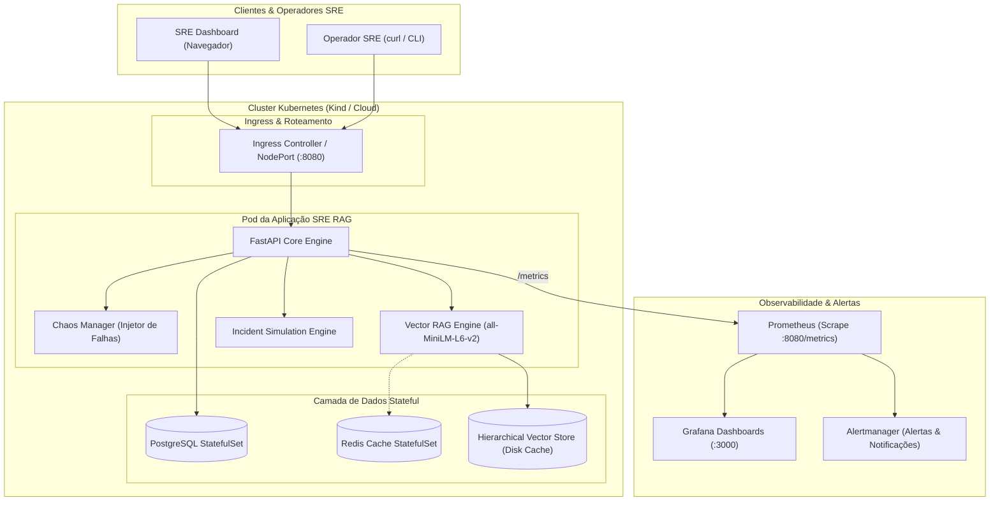
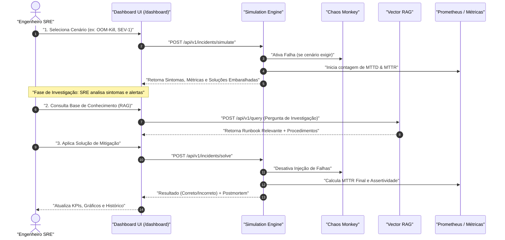
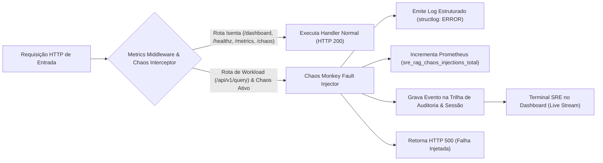
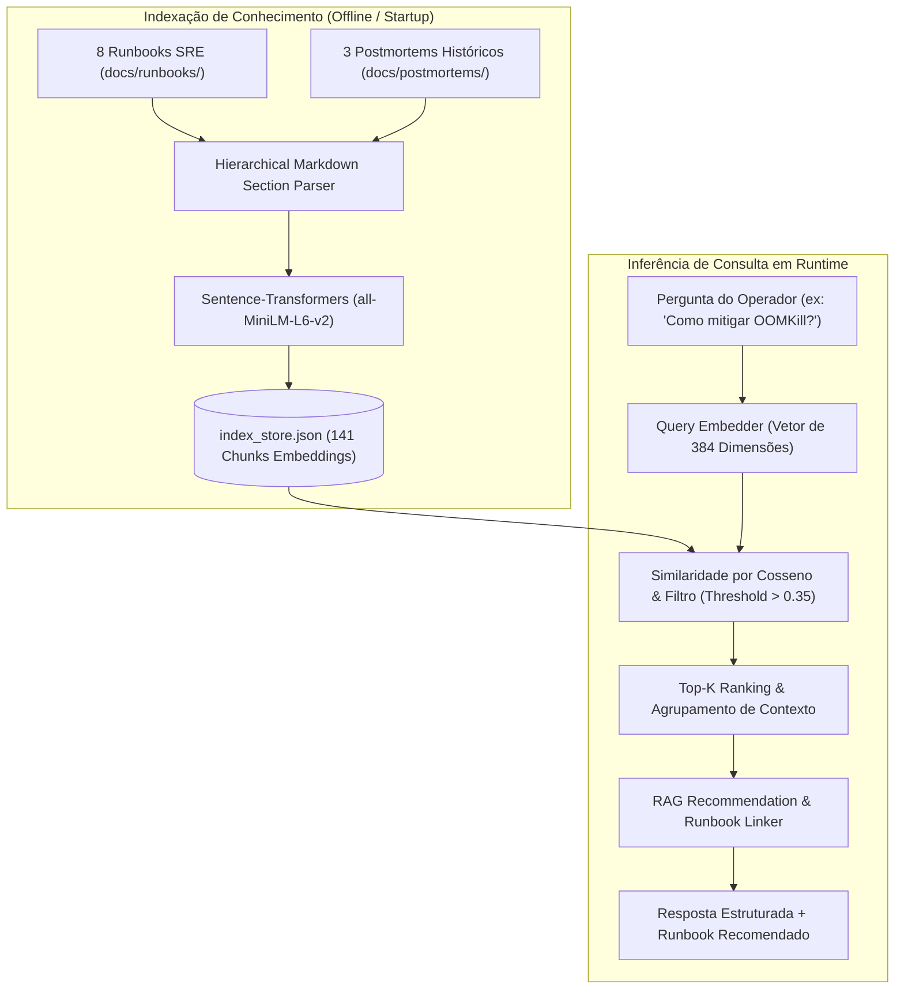

# 🚨 SRE RAG Agent — Incident Simulation Lab & Observability Platform

<p align="center">
  
  <a href="README_EN.md"></a>
  
  
  
  
  
  
</p>

> **Ambiente Completo de Prática e Engenharia de Confiabilidade (SRE)**: Simulação interativa de incidentes em Kubernetes, motor de busca vetorial RAG (*Retrieval-Augmented Generation*) para Runbooks, injeção de falhas com **Chaos Monkey**, auditoria em tempo real, framework de avaliação de IA e observabilidade ponta a ponta com Prometheus e Grafana.

---

## 📑 Sumário

- [Visão Geral & Novas Features](#-visão-geral--novas-features)
- [Arquitetura do Sistema](#-arquitetura-do-sistema)
- [Fluxo de Resposta a Incidentes (MTTD & MTTR)](#-fluxo-de-resposta-a-incidentes-mttd--mttr)
- [Chaos Monkey & Trilha de Auditoria](#-chaos-monkey--trilha-de-auditoria)
- [Motor de Busca Vetorial RAG](#-motor-de-busca-vetorial-rag)
- [Framework de Avaliação SRE](#-framework-de-avaliação-sre)
- [Estrutura do Repositório](#-estrutura-do-repositório)
- [Guia Rápido (Quick Start)](#-guia-rápido-quick-start)
- [SLIs, SLOs & Observabilidade](#-slis-slos--observabilidade)
- [Segurança & Ambientes](#-segurança--ambientes)
- [Autor & Licença](#-autor--licença)

---

## 🌟 Visão Geral & Novas Features

Este projeto evoluiu de um protótipo para um **Laboratório de Engenharia SRE de Padrão Google**:

1. **🎯 Painel Interativo de Simulação de Incidentes (`/dashboard`)**:
   - 8 cenários realistas de falha em Kubernetes (OOM-Kill, CrashLoopBackOff, Degradação TLS, Esgotamento Redis, Pressão de Disco, Falha de DNS, Alta Latência e Alta Taxa de Erro).
   - Embaralhamento aleatório das opções de solução a cada simulação, impedindo respostas mecânicas.
   - Cálculo e exibição em tempo real de KPIs: **MTTD Médio**, **MTTR Médio**, **Taxa de Assertividade** e gráficos SVG de tendências.

2. **🐒 Chaos Monkey & Auditoria de Resiliência (`app/chaos.py`)**:
   - Injeção controlada de erros `HTTP 500` no workload de inferência.
   - **Isolamento do Plano de Controle**: O Dashboard, health checks (`/healthz`, `/ready`), métricas Prometheus e endpoints de controle permanecem 100% disponíveis.
   - **Sessões Rastreadas**: Cada janela de teste armazena timestamp de início/fim, duração precisa em segundos e contagem de falhas por endpoint.
   - **Terminal SRE de Auditoria em Tempo Real**: Interface estilo macOS no dashboard com stream ao vivo de logs coloridos (`[ATIVADO]`, `[500 INJETADO]`, `[DESATIVADO]`).
   - Métricas Prometheus dedicadas (`sre_rag_chaos_injections_total`, `sre_rag_chaos_active`).

3. **🧠 Motor RAG com Embeddings Vetoriais Reais (`app/rag/`)**:
   - Substituição de buscas sintéticas por embeddings reais com `sentence-transformers` (`all-MiniLM-L6-v2`, 384 dimensões).
   - Indexador de seções hierárquicas em markdown com cache local persistido em disco (`index_store.json`, 141 chunks).
   - 8 Runbooks completos de padrão Google SRE (`docs/runbooks/`) e 3 Postmortems históricos (`docs/postmortems/`) com Análise de 5 Porquês e itens de ação.
   - Fallback offline transparente: consultas executam em ~20ms mesmo sem conectividade com o Redis local.

4. **📈 Framework de Avaliação Automatizada (`tests/eval/`)**:
   - Dataset de benchmark com 10 casos de teste de verdade-terrestre (`benchmark_dataset.json`).
   - Avaliador matemático calculando **Hit Rate@K** (100%), **MRR** (0.925), **Context Precision** (70%) e **Safety Score** (100%).
   - Geração automática de relatório analítico em [`docs/eval-report.md`](docs/eval-report.md).

5. **🛡️ Endurecimento de Segurança & Swagger Gating**:
   - Documentação Swagger/OpenAPI ativa exclusivamente em ambiente de desenvolvimento/teste (`ENVIRONMENT=development`).
   - Em produção (`ENVIRONMENT=production`), o Swagger é desativado nativamente (`docs_url=None, redoc_url=None, openapi_url=None`) para prevenir reconhecimento de superfície de ataque e enumeração de rotas.
   - Remoção de links públicos ao Swagger na interface principal em consonância com as melhores práticas de DevSecOps.

6. **📑 Navegação por Abas & Visual Clean (v2.1)**:
   - Separação clara entre a área operacional (`🎯 Simulação & Chaos Lab`) e o painel analítico (`📊 Painel de Histórico & Métricas`), reduzindo a sobrecarga cognitiva durante incidentes.
   - Roteamento por hash (`#simulation` / `#history`) com persistência imediata e alternância sem recarregamento de página.
   - Escala tipográfica modernizada (v2.1.2) com badges expandidos, contraste balanceado e correção de overflow no gráfico de MTTR.

7. **🌐 Suporte Bilíngue Nativo (pt-BR / en-US)**:
   - Seletor de idiomas dinâmico com persistência em `localStorage`.
   - Cobertura completa de traduções: 8 cenários de incidentes, sintomas, diagnósticos de IA, opções de mitigação, estados do Chaos Monkey e relatórios postmortem.

---

## 🏗️ Arquitetura do Sistema

O diagrama abaixo ilustra o ecossistema completo de microsserviços, injeção de falhas, armazenamento de vetores e monitoramento:



---

## ⏱️ Fluxo de Resposta a Incidentes (MTTD & MTTR)

O ciclo de vida de uma simulação de incidente no laboratório segue o padrão recomendado pelo Google SRE:



---

## 🐒 Chaos Monkey & Trilha de Auditoria

O Chaos Monkey foi projetado para testes de estresse seguros sem indisponibilizar a infraestrutura de controle:



### Endpoints do Chaos Monkey

| Método | Endpoint | Descrição |
|--------|----------|-----------|
| `GET` | `/api/v1/chaos/status` | Retorna o status atual, duração da sessão e telemetria |
| `POST` | `/api/v1/chaos/500?enable=true\|false` | Ativa ou encerra a injeção de falhas com auditoria |
| `GET` | `/api/v1/chaos/history` | Histórico completo de sessões passadas com duração e falhas |
| `GET` | `/api/v1/chaos/events?limit=50` | Trilha cronológica de eventos com IP, endpoint e timestamp |
| `POST` | `/api/v1/chaos/history/clear` | Limpa o histórico de sessões e eventos de auditoria |

---

## 🧠 Motor de Busca Vetorial RAG

O pipeline de recuperação vetorial processa runbooks e postmortems em chunks hierárquicos e calcula similaridade de cossenos:



---

## 📈 Framework de Avaliação SRE

O framework avalia a qualidade das respostas do RAG contra o dataset de referência:

| Métrica | Meta SRE | Score Obtido | Status | Descrição |
|---------|----------|--------------|--------|-----------|
| **Hit Rate @ 3** | &ge; 80% | **100.0%** | ✅ APROVADO | O documento correto esteve no Top-3 em 100% dos testes |
| **MRR (Mean Reciprocal Rank)** | &ge; 0.70 | **0.925** | ✅ APROVADO | O runbook correto aparece majoritariamente na 1ª posição |
| **Context Precision** | &ge; 60% | **70.0%** | ✅ APROVADO | Precisão do contexto recuperado para mitigação |
| **Safety Score** | 100% | **100.0%** | ✅ APROVADO | Nenhuma ação destrutiva sem aprovação foi sugerida |

Para rodar a avaliação manualmente:
```bash
make eval
# ou: python tests/eval/evaluator.py
```
O relatório consolidado é gerado em [`docs/eval-report.md`](docs/eval-report.md).

---

## 📁 Estrutura do Repositório

```
sre_rag_agent/
├── app/                         # Aplicação Python & FastAPI
│   ├── chaos.py                 # Gestão de Chaos Engineering, sessões e auditoria
│   ├── config.py                # Configurações de ambiente (Dev / Test / Prod)
│   ├── incidents.py             # Cenários de incidentes e motor de simulação
│   ├── main.py                  # API principal, middleware RED e rotas
│   ├── metrics.py               # Métricas Prometheus (RED, USE e Chaos)
│   ├── healthcheck.py           # Probes K8s (liveness, readiness, startup)
│   ├── rag/                     # Módulo RAG
│   │   ├── engine.py            # Motor de busca vetorial e inferência
│   │   ├── indexer.py           # Indexador de markdown e embeddings
│   │   └── index_store.json     # Cache persistido de 141 chunks vetoriais
│   ├── static/                  # CSS e JavaScript do Dashboard
│   └── templates/               # Templates Jinja2 (dashboard.html, board.html)
├── docs/                        # Documentação Técnica
│   ├── runbooks/                # 8 Runbooks completos de incidentes
│   ├── postmortems/             # 3 Postmortems reais com 5 Porquês
│   └── eval-report.md           # Relatório da avaliação automatizada
├── helm/                        # Helm Charts para Kubernetes
│   └── sre-rag/                 # Chart com HPA, PDB, NetworkPolicies, ServiceMonitor
├── monitoring/                  # Observabilidade
│   ├── prometheus/              # Regras de alerta e scrape config
│   ├── grafana/                 # Dashboards SRE (RED metrics, SLOs, Chaos)
│   └── alertmanager/            # Configuração de rotas de alerta
├── tests/                       # Suíte de Testes Automatizados
│   ├── eval/                    # Benchmark dataset e avaliador
│   ├── test_chaos.py            # Testes do Chaos Monkey e isolamento
│   ├── test_incidents.py        # Testes do motor de simulação
│   └── test_rag.py              # Testes do motor vetorial RAG
├── Makefile                     # Automação de tarefas
├── README.md                    # Documentação em Português
└── README_EN.md                 # Documentação em Inglês
```

---

## 🚀 Guia Rápido (Quick Start)

### Pré-requisitos
- Python 3.12+
- Docker & Docker Compose
- Kind / Kubernetes CLI (`kubectl`)
- Make

### 1. Clonar e Instalar Dependências
```bash
git clone https://github.com/magnomct/sre_rag_agent.git
cd sre_rag_agent

# Criar ambiente virtual e instalar pacotes
make setup
```

### 2. Executar Localmente em Modo Desenvolvimento
```bash
make dev
```
Acesse os serviços nos seguintes endereços:
- **SRE Incident Lab Dashboard**: [http://localhost:8080/dashboard](http://localhost:8080/dashboard)
- **Board de Histórico CRUD**: [http://localhost:8080/board](http://localhost:8080/board)
- **Métricas Prometheus**: [http://localhost:8080/metrics](http://localhost:8080/metrics)
- **Documentação Swagger (Dev)**: [http://localhost:8080/docs](http://localhost:8080/docs)

### 3. Rodar a Suíte Completa de Testes
```bash
make test
```
*Executa os 8 testes unitários e de integração, cobrindo Chaos Monkey, RAG vetorial e simulações.*

### 4. Deploy no Kubernetes Local (Kind)
```bash
# Criar cluster local Kind
make cluster-create

# Fazer build da imagem e deploy via Helm
make build deploy

# Habilitar encaminhamento de portas
make port-forward
```

### 5. Como Desativar o Lab
Para encerrar o ambiente local:
```bash
# Encerrar servidor dev
pkill -f "uvicorn" && fuser -k 8080/tcp 2>/dev/null

# Parar containers auxiliares
docker compose down

# Deletar cluster Kubernetes local (se utilizado)
kind delete cluster --name sre-rag
```

---

## 📊 SLIs, SLOs & Observabilidade

| Serviço | SLI | SLO | Janela | Métrica Prometheus |
|---------|-----|-----|--------|--------------------|
| **API Workload** | Disponibilidade (status < 500) | **99.9%** | 30d | `sli_request_success_total / sli_request_total` |
| **API Latência** | Latência p99 < 500ms | **99.5%** | 30d | `http_request_duration_seconds_bucket` |
| **PostgreSQL** | Conexões ativas < 80% do limite | **99.9%** | 30d | `db_connections_active{database="postgresql"}` |
| **Redis Cache** | Cache Hit Rate > 80% | **99.0%** | 30d | `cache_hits_total / (cache_hits_total + cache_misses_total)` |
| **Chaos Active** | Monitoramento de injeção ativa | N/A | Realtime | `sre_rag_chaos_active` (Gauge: 0 ou 1) |

---

## 🛡️ Segurança & Ambientes

- **Ambiente de Desenvolvimento (`ENVIRONMENT=development`)**:
  - Swagger UI e OpenAPI habilitados em `/docs` e `/openapi.json`.
  - Reload automático ativado.
- **Ambiente de Produção (`ENVIRONMENT=production`)**:
  - Swagger UI e esquemas OpenAPI desabilitados (`docs_url=None`).
  - Links de documentação removidos dos cabeçalhos das páginas.
  - Segurança aprimorada contra reconhecimento e fingerprinting de APIs.

---

## 👤 Autor & Licença

Desenvolvido por **Carlos Magno Cordeiro**  
GitHub: [@magnomct](https://github.com/magnomct) &middot; Repositório: [sre_rag_agent](https://github.com/magnomct/sre_rag_agent)

Distribuído sob a licença **MIT**. Consulte o arquivo [LICENSE](LICENSE) para obter mais informações.
