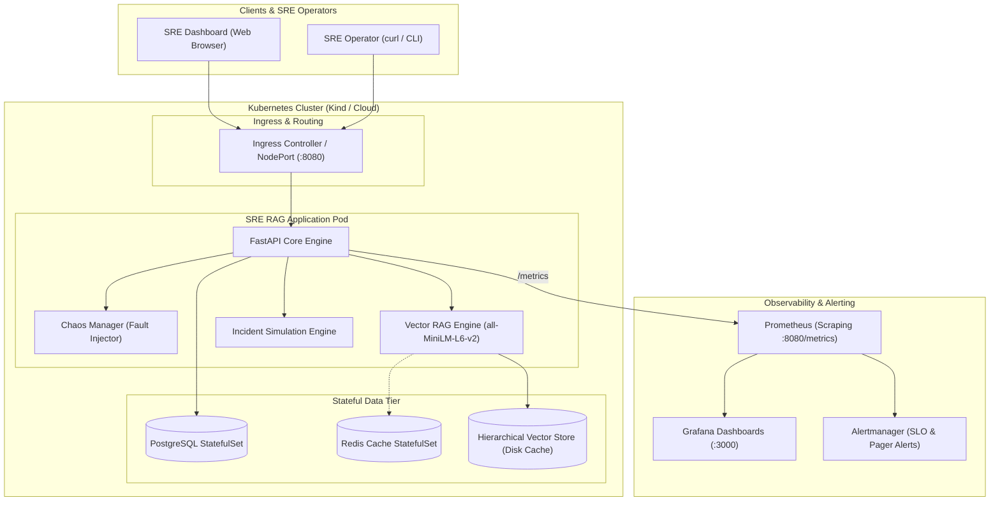
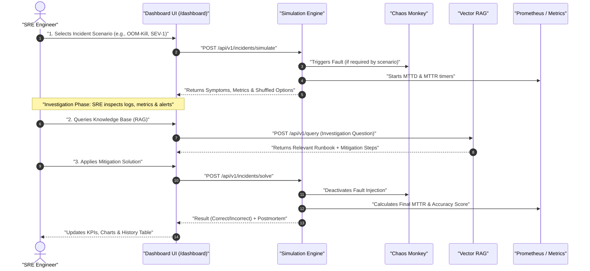
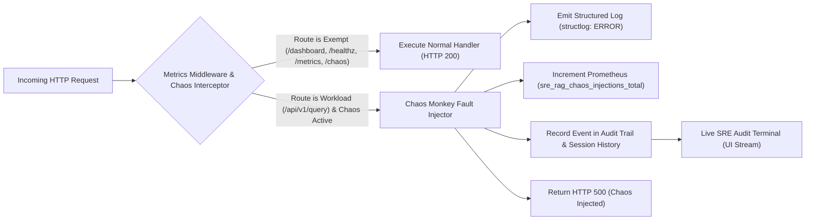
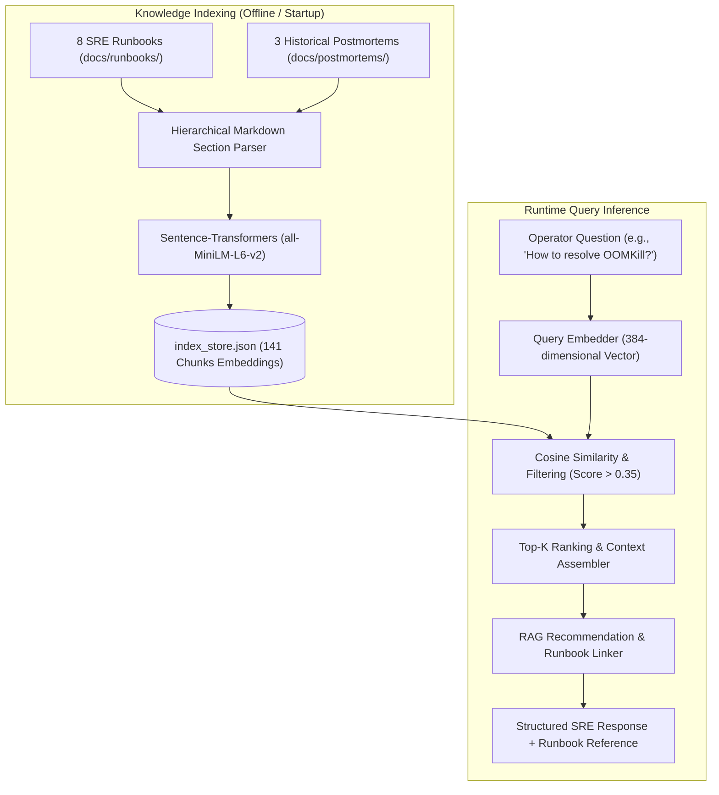

# 🚨 SRE RAG Agent — Incident Simulation Lab & Observability Platform

<p align="center">
  <a href="README.md"></a>
  
  
  
  
  
  
  
</p>

> **Full-Stack Site Reliability Engineering (SRE) Practice & Simulation Lab**: Interactive incident response dynamics on Kubernetes, vector-based RAG (*Retrieval-Augmented Generation*) for operational runbooks, controlled fault injection with **Chaos Monkey**, live audit trail streaming, automated AI evaluation framework, and end-to-end observability via Prometheus and Grafana.

---

## 📑 Table of Contents

- [Overview & Key Features](#-overview--key-features)
- [System Architecture](#-system-architecture)
- [Incident Response Lifecycle (MTTD & MTTR)](#-incident-response-lifecycle-mttd--mttr)
- [Chaos Monkey & Audit Trail](#-chaos-monkey--audit-trail)
- [Vector RAG Retrieval Engine](#-vector-rag-retrieval-engine)
- [SRE Evaluation Framework](#-sre-evaluation-framework)
- [Repository Structure](#-repository-structure)
- [Quick Start Guide](#-quick-start-guide)
- [SLIs, SLOs & Observability](#-slis-slos--observability)
- [Security & Environment Gating](#-security--environment-gating)
- [Author & License](#-author--license)

---

## 🌟 Overview & Key Features

This project was built and evolved into a **Google SRE-standard Practice and Training Lab**:

1. **🎯 Interactive Incident Simulation Dashboard (`/dashboard`)**:
   - 8 authentic Kubernetes incident scenarios (OOM-Kill, CrashLoopBackOff, TLS Expiration, Redis Exhaustion, Disk Pressure, DNS Failure, High Latency, and High Error Rate).
   - Solution options are dynamically shuffled on each simulation to avoid rote memorization.
   - Real-time calculation and visualization of SRE KPIs: **Average MTTD**, **Average MTTR**, **Success Rate**, and SVG trend charts.

2. **🐒 Chaos Monkey & Resilience Audit System (`app/chaos.py`)**:
   - Controlled `HTTP 500` fault injection targeted specifically at workload inference endpoints.
   - **Control Plane Isolation**: The Dashboard, health probes (`/healthz`, `/ready`), Prometheus metrics, and management APIs remain 100% operational.
   - **Tracked Sessions**: Every chaos session records start/end timestamps, exact duration in seconds, and an affected endpoint failure map.
   - **Live SRE Audit Terminal**: A macOS-styled terminal on the dashboard streaming real-time colored event logs (`[ACTIVATED]`, `[500 INJECTED]`, `[DEACTIVATED]`).
   - Dedicated Prometheus metrics (`sre_rag_chaos_injections_total`, `sre_rag_chaos_active`).

3. **🧠 Vector RAG Knowledge Retrieval Engine (`app/rag/`)**:
   - Real vector embeddings powered by `sentence-transformers` (`all-MiniLM-L6-v2`, 384 dimensions).
   - Hierarchical markdown section parser with local disk caching (`index_store.json`, 141 chunks).
   - 8 comprehensive Google-SRE-grade Runbooks (`docs/runbooks/`) and 3 realistic historical Postmortems (`docs/postmortems/`) featuring 5 Whys analysis and action items.
   - Seamless offline fallback: queries execute in ~20ms even when local Redis is offline.

4. **📈 Automated SRE Evaluation Framework (`tests/eval/`)**:
   - Benchmark dataset with 10 ground-truth test cases (`benchmark_dataset.json`).
   - Evaluator computing **Hit Rate@K** (100%), **MRR** (0.925), **Context Precision** (70%), and **Safety Score** (100%).
   - Automated report generation in [`docs/eval-report.md`](docs/eval-report.md).

5. **🛡️ Production Security & Swagger Gating**:
   - Swagger / OpenAPI documentation is active exclusively in development/testing mode (`ENVIRONMENT=development`).
   - In production (`ENVIRONMENT=production`), Swagger is disabled (`docs_url=None`) to prevent attack surface discovery.

---

## 🏗️ System Architecture

The following diagram illustrates the complete microservices architecture, fault injection, vector storage, and observability stack:



---

## ⏱️ Incident Response Lifecycle (MTTD & MTTR)

The incident simulation lifecycle in the lab follows the standard Google SRE incident mitigation workflow:



---

## 🐒 Chaos Monkey & Audit Trail

Chaos Monkey is designed for safe resilience validation without breaking the control plane:



### Chaos Monkey API Endpoints

| Method | Endpoint | Description |
|--------|----------|-------------|
| `GET` | `/api/v1/chaos/status` | Returns current state, active session duration, and telemetry |
| `POST` | `/api/v1/chaos/500?enable=true\|false` | Starts or concludes error injection with audit logging |
| `GET` | `/api/v1/chaos/history` | Complete historical archive of past sessions and impacted endpoints |
| `GET` | `/api/v1/chaos/events?limit=50` | Chronological audit trail of events with client IP and timestamps |
| `POST` | `/api/v1/chaos/history/clear` | Clears sessions history and audit events log |

---

## 🧠 Vector RAG Retrieval Engine

The knowledge retrieval pipeline processes operational documentation into hierarchical chunks and performs cosine similarity search:



---

## 📈 SRE Evaluation Framework

The evaluation framework automatically scores RAG retrieval quality against ground-truth benchmarks:

| Metric | Target | Result Score | Status | Description |
|--------|--------|--------------|--------|-------------|
| **Hit Rate @ 3** | &ge; 80% | **100.0%** | ✅ PASSED | The correct runbook was in the Top-3 in 100% of test cases |
| **MRR (Mean Reciprocal Rank)** | &ge; 0.70 | **0.925** | ✅ PASSED | The relevant document ranks in the 1st position in most queries |
| **Context Precision** | &ge; 60% | **70.0%** | ✅ PASSED | Precision of context retrieved for incident troubleshooting |
| **Safety Score** | 100% | **100.0%** | ✅ PASSED | Zero destructive commands were suggested without approval gates |

Run evaluation manually via:
```bash
make eval
# or: python tests/eval/evaluator.py
```
A consolidated report is written to [`docs/eval-report.md`](docs/eval-report.md).

---

## 📁 Repository Structure

```
sre_rag_agent/
├── app/                         # Python Application & FastAPI Core
│   ├── chaos.py                 # Chaos Engineering manager, sessions & audit trail
│   ├── config.py                # Environment configurations (Dev / Test / Prod)
│   ├── incidents.py             # Incident scenarios and simulation engine
│   ├── main.py                  # Main API server, RED middleware and routes
│   ├── metrics.py               # Prometheus metrics (RED, USE, and Chaos)
│   ├── healthcheck.py           # K8s probes (liveness, readiness, startup)
│   ├── rag/                     # RAG Engine Module
│   │   ├── engine.py            # Vector similarity search & inference
│   │   ├── indexer.py           # Markdown section indexer and embeddings
│   │   └── index_store.json     # Persisted disk cache of 141 vector chunks
│   ├── static/                  # Dashboard CSS and JavaScript assets
│   └── templates/               # Jinja2 HTML templates (dashboard.html, board.html)
├── docs/                        # Technical Documentation
│   ├── runbooks/                # 8 comprehensive incident runbooks
│   ├── postmortems/             # 3 real-world postmortems with 5 Whys
│   └── eval-report.md           # Automated RAG evaluation report
├── helm/                        # Kubernetes Helm Charts
│   └── sre-rag/                 # Production chart with HPA, PDB, NetworkPolicies
├── monitoring/                  # Observability
│   ├── prometheus/              # Alert rules & Prometheus scrape configuration
│   ├── grafana/                 # Dashboards (RED metrics, SLOs, Chaos)
│   └── alertmanager/            # Routing configuration for incident alerts
├── tests/                       # Automated Test Suite
│   ├── eval/                    # Benchmark dataset & evaluator
│   ├── test_chaos.py            # Chaos Monkey lifecycle & isolation tests
│   ├── test_incidents.py        # Simulation lifecycle tests
│   └── test_rag.py              # Vector RAG tests
├── Makefile                     # Task automation
├── README.md                    # Portuguese Documentation
└── README_EN.md                 # English Documentation
```

---

## 🚀 Quick Start Guide

### Prerequisites
- Python 3.12+
- Docker & Docker Compose
- Kind / Kubernetes CLI (`kubectl`)
- Make

### 1. Clone and Install Dependencies
```bash
git clone https://github.com/magnomct/sre_rag_agent.git
cd sre_rag_agent

# Create virtual environment and install dependencies
make setup
```

### 2. Run Locally in Development Mode
```bash
make dev
```
Access the application services:
- **SRE Incident Lab Dashboard**: [http://localhost:8080/dashboard](http://localhost:8080/dashboard)
- **History Board (CRUD)**: [http://localhost:8080/board](http://localhost:8080/board)
- **Prometheus Metrics**: [http://localhost:8080/metrics](http://localhost:8080/metrics)
- **Swagger Documentation (Dev)**: [http://localhost:8080/docs](http://localhost:8080/docs)

### 3. Run the Automated Test Suite
```bash
make test
```
*Runs all 8 unit and integration tests covering Chaos Monkey, vector RAG, and incident workflows.*

### 4. Deploy to Local Kubernetes (Kind)
```bash
# Create local Kind cluster
make cluster-create

# Build container image and deploy via Helm
make build deploy

# Enable port forwarding
make port-forward
```

### 5. How to Stop / Deactivate the Lab
To cleanly tear down the local lab:
```bash
# Stop dev server and release port 8080
pkill -f "uvicorn" && fuser -k 8080/tcp 2>/dev/null

# Stop Docker Compose containers
docker compose down

# Delete local Kubernetes cluster (if created)
kind delete cluster --name sre-rag
```

---

## 📊 SLIs, SLOs & Observability

| Service | SLI | SLO | Window | Prometheus Metric |
|---------|-----|-----|--------|-------------------|
| **API Workload** | Availability (status < 500) | **99.9%** | 30d | `sli_request_success_total / sli_request_total` |
| **API Latency** | p99 Latency < 500ms | **99.5%** | 30d | `http_request_duration_seconds_bucket` |
| **PostgreSQL** | Active connections < 80% limit | **99.9%** | 30d | `db_connections_active{database="postgresql"}` |
| **Redis Cache** | Cache Hit Rate > 80% | **99.0%** | 30d | `cache_hits_total / (cache_hits_total + cache_misses_total)` |
| **Chaos Active** | Fault injection monitoring | N/A | Realtime | `sre_rag_chaos_active` (Gauge: 0 or 1) |

---

## 🛡️ Security & Environment Gating

- **Development Environment (`ENVIRONMENT=development`)**:
  - Swagger UI and OpenAPI documentation enabled at `/docs` and `/openapi.json`.
  - Hot reload enabled for rapid iteration.
- **Production Environment (`ENVIRONMENT=production`)**:
  - Swagger UI and OpenAPI specifications disabled (`docs_url=None`).
  - Swagger navigation links removed from dashboard headers.
  - Defense-in-depth against API scanning and automated fingerprinting.

---

## 👤 Author & License

Developed by **Carlos Magno Cordeiro**  
GitHub: [@magnomct](https://github.com/magnomct) &middot; Repository: [sre_rag_agent](https://github.com/magnomct/sre_rag_agent)

Distributed under the **MIT License**. See the [LICENSE](LICENSE) file for more information.
