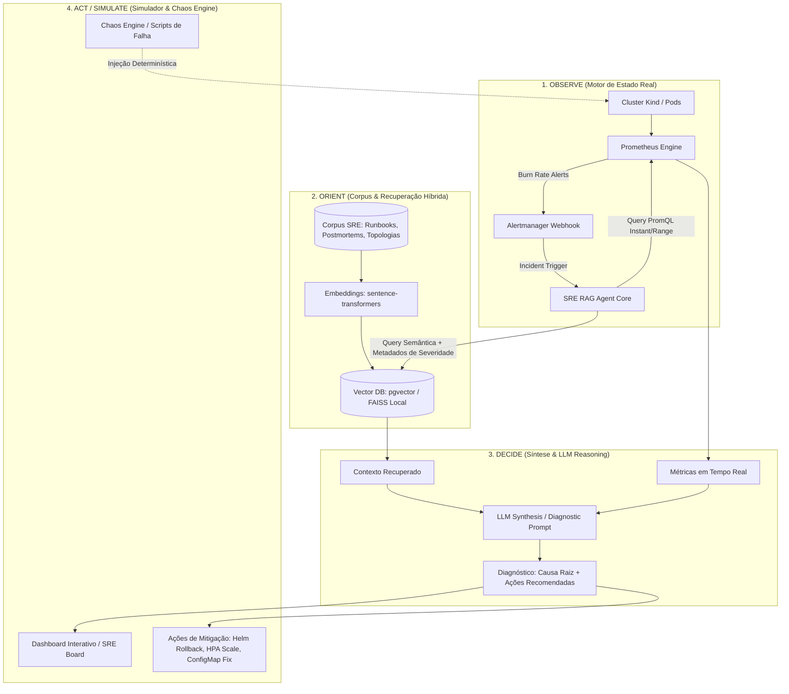

# 🏛️ Parecer Arquitetural e Plano de Evolução: SRE RAG Agent

**Autor:** Arquiteto Claude & Equipe de Engenharia  
**Data:** Outubro de 2026  
**Status:** Proposta Técnica para Aprovação  
**Repositório:** [magnomct/sre_rag_agent](https://github.com/magnomct/sre_rag_agent)

---

## 1. Resumo Executivo e Validação das Recomendações

A análise submetida pelo **Claude Desktop** diagnosticou com precisão cirúrgica a maturidade e os gargalos do projeto:

> **"O seu projeto já tem a parte mais difícil de uma simulação SRE, um ambiente real (Kind + Prometheus + Alertmanager) que serve como motor de estado. Isso resolve o principal limite do RAG que apontei antes. O que falta é o corpus e a camada de avaliação. A arquitetura atual é uma boa base para o agente de simulações."**

### Matriz de Diagnóstico Arquitetural: O que temos vs. O que falta

| Pilar SRE / IA | Estado Atual no Repositório | Veredito Arquitetural | Ação Prioritária |
|---|---|---|---|
| **1. Motor de Estado Determinístico** | Cluster Kind com pods reais, Prometheus MWMBR (`slo-rules.yml`), Alertmanager e Grafana. | **Excelente (Diferencial raro)**: Não simula métricas fictícias; o cluster expõe estado autêntico. | Manter como base e integrar via API ao agente. |
| **2. Geração de Sinais Realistas** | Métricas RED/USE no FastAPI (`metrics.py`), alertas MWMBR (burn rates 1h/6h). | **Forte na camada de métricas, Desconectado do RAG**: O RAG não consulta o Prometheus dinamicamente. | Conectar o RAG às métricas ativas via PromQL API / Tool Calling. |
| **3. Injeção de Falhas (Chaos)** | Apenas `load-test.sh` (tráfego HTTP) e toggle booleano `/api/v1/chaos/500`. 7 de 8 cenários do simulador têm `chaos_action: None`. | **Parcial / Simulação cosmética**: Falta injeção de caos em nível de infraestrutura/pod/rede. | Criar suíte de scripts de injeção de caos reais para os 8 cenários. |
| **4. Corpus & Base de Conhecimento** | Apenas 2 runbooks (`high-error-rate.md` e `high-latency.md`). O `rag/engine.py` retorna 3 documentos hardcoded mock (`doc-001..003`). | **Crítico (Maior gargalo)**: O RAG não indexa a documentação real do repositório. | Criar os 6 runbooks faltantes + postmortems históricos + pipeline de ingestão vetorial. |
| **5. Camada de Avaliação (Eval)** | Nenhuma suíte de testes de RAG ou acurácia SRE (`tests/` inexistente). | **Crítico (Inexistente)**: Sem métricas de recuperação (Hit Rate, MRR) nem de geração (Faithfulness, SRE Accuracy). | Implementar framework de avaliação baseado na RAG Triad e SRE Ground Truth Benchmark. |

---

## 2. Arquitetura Alvo: Do RAG Estático ao Agente SRE OODA Loop

A transição recomendada move o agente de um simples recuperador de texto mock para um **Agente de Investigação e Resposta a Incidentes SRE** orientado pelo loop **OODA** (Observe, Orient, Decide, Act):

---

## 3. Detalhamento dos Componentes a Desenvolver

### A. Corpus Documental Enriquecido (A Base do RAG)
O simulador já contempla 8 cenários, porém faltam os runbooks e postmortems correspondentes:
1. `high-error-rate.md` *(existente)*
2. `high-latency.md` *(existente)*
3. `crashloopbackoff.md` *(a criar: diagnóstico de falha de env var, logs, probe failure)*
4. `tls-expiring.md` *(a criar: cert-manager, ClusterIssuer, renovação preventiva)*
5. `disk-pressure.md` *(a criar: eviction de pods, cordon/drain, limpeza de disco)*
6. `redis-exhausted.md` *(a criar: connection pool saturation, maxclients, cascata de latência)*
7. `oom-kill.md` *(a criar: memory limits, kernel exit code 137, profiling de heap)*
8. `dns-failure.md` *(a criar: CoreDNS troubleshooting, NetworkPolicy UDP/53)*
9. `docs/postmortems/` *(corpus de postmortems históricos para aprendizado de causalidade)*

### B. Pipeline de Ingestão e Indexação Vetorial Real
Substituir o mock em `app/rag/engine.py` por:
- Leitor automático de arquivos Markdown (`docs/runbooks/*.md`, `docs/postmortems/*.md`, `docs/*.md`).
- Chunking semântico preservando seções: Alertas associados, Queries PromQL, Comandos de mitigação.
- Indexação via `SentenceTransformer` com busca vetorial por similaridade de cosseno.
- Cache em Redis determinístico mantido para performance.

### C. Camada de Avaliação (SRE-Eval Framework)
Implementar uma suíte de avaliação automatizada (`tests/eval/`):
1. **Dataset Ground-Truth (`eval_dataset.json`)**: 20+ pares de perguntas de incidentes com ground truth (causa raiz, runbook esperado, comandos de mitigação ideais, armadilhas proibidas).
2. **Métricas da RAG Triad**:
   - **Context Relevance / Precision**: As partes do runbook recuperadas são pertinentes ao incidente relatado?
   - **Context Recall**: O runbook correto para o cenário foi incluído no top-K?
   - **Faithfulness (Ausência de Alucinação)**: A resposta proposta baseia-se estritamente no runbook e nas métricas?
   - **Answer Relevance**: A resposta responde diretamente ao problema do operador?
3. **Métrica SRE Decision Score**:
   - Diagnóstico da Causa Raiz Correto (+40 pts)
   - Recomendação da Ação de Menor MTTR (+40 pts)
   - Não recomendação de Ação Anti-Pattern (+20 pts)

### D. Chaos Engineering Determinístico
Criar scripts em `scripts/chaos/` para injeção real e reversão:
- `chaos-500.sh`: Dispara erros 500 via API.
- `chaos-latency.sh`: Injeta latência de rede ou saturação.
- `chaos-crashloop.sh`: Atualiza deployment com env var incorreta para disparar CrashLoopBackOff real.
- `chaos-oom.sh`: Satura limites de memória para acionar o OOMKiller do kernel.
- `chaos-clean.sh`: Reverte o caos e retorna o cluster ao estado saudável.

---

## 4. Plano de Execução Faseado

### Fase 1: Enriquecimento do Corpus e Pipeline de Ingestão Real
- **Objetivo:** Acabar com os dados mock em `_retrieve_documents`.
- **Entregáveis:**
  1. Criação dos 6 runbooks faltantes em `docs/runbooks/`.
  2. Criação de postmortems históricos realistas em `docs/postmortems/`.
  3. Script de ingestão e indexação vetorial semântica (`app/rag/indexer.py`).
  4. Atualização de `app/rag/engine.py` para consultar o índice vetorial real.

### Fase 2: Framework de Avaliação do RAG (SRE-Eval)
- **Objetivo:** Estabelecer a camada de avaliação científica e mensurável.
- **Entregáveis:**
  1. `tests/eval/benchmark_dataset.json`: Casos de teste estruturados.
  2. `tests/eval/evaluator.py`: Script de cálculo de métricas (Hit Rate@K, MRR, Precision, Decision Accuracy).
  3. Relatório automatizado de avaliação em Markdown (`docs/eval-report.md`).
  4. Inclusão do target `make eval` e `make test` no `Makefile`.

### Fase 3: Chaos Engineering & Injeção de Falhas Realista
- **Objetivo:** Fazer o simulador interagir com o cluster Kind/Kubernetes real.
- **Entregáveis:**
  1. `scripts/chaos/*.sh` com comandos determinísticos de injeção e cura.
  2. Integração no `IncidentSimulationEngine` para acionar as falhas reais.

### Fase 4: Integração de Live Observability com Prometheus API
- **Objetivo:** Fazer o agente inspecionar métricas reais antes de formular o diagnóstico.
- **Entregáveis:**
  1. Cliente HTTP para a API do Prometheus (`/api/v1/query`).
  2. Injeção de métricas de Golden Signals no prompt de diagnóstico do RAG.

---

## 5. Status do Front-end (Item Solicitado)
- **Validação:** O rodapé profissional com link do GitHub (`magnomct/sre_rag_agent`), licença MIT e créditos de autoria (*Carlos Magno Cordeiro 2026*) já está **100% implementado e ativo** nas interfaces `dashboard.html` e `board.html`.
