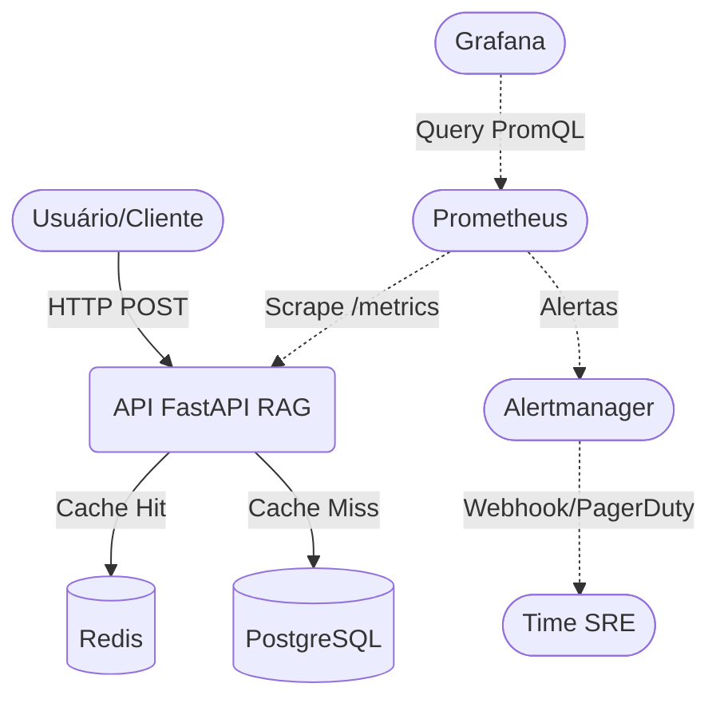

# Arquitetura do SRE Production Lab

## Visão Geral

Este laboratório simula um ambiente de produção moderno operado sob os princípios de **Site Reliability Engineering (SRE)**. A arquitetura foi desenhada para ser resiliente, observável e escalável.

## Componentes

### 1. Aplicação (API RAG)
- **Tecnologia:** Python 3.12, FastAPI, LangChain, Sentence-transformers.
- **Função:** Fornece um endpoint `POST /api/v1/query` de RAG (Retrieval-Augmented Generation).
- **Chaos Engineering:** Possui um endpoint `POST /api/v1/chaos/500` para injeção de falhas controladas, permitindo testar a observabilidade e resposta a incidentes.

### 2. Bancos de Dados e Cache
- **PostgreSQL (Vector DB Mock):** Armazena os embeddings e documentos. Implantado como um `StatefulSet` no Kubernetes com volumes persistentes.
- **Redis:** Atua como camada de cache para consultas frequentes, diminuindo a carga no banco de dados e melhorando a latência. Também roda como `StatefulSet`.

### 3. Kubernetes (Plataforma)
- **Deployment & HPA:** A API roda sob um `Deployment` gerenciado por um `HorizontalPodAutoscaler` (HPA) baseado em CPU/Memória.
- **PodDisruptionBudget (PDB):** Garante alta disponibilidade (minAvailable) durante manutenções nos nós.
- **NetworkPolicies:** Aplica o princípio de privilégio mínimo (Zero Trust). A API só pode falar com Postgres/Redis. Postgres/Redis só aceitam tráfego da API.

### 4. Observabilidade (Stack Prometheus)
- **Prometheus:** Coleta métricas da API (RED methodology - Rate, Errors, Duration) e recursos do cluster via `ServiceMonitor`. Contém Recording Rules para computar SLIs em tempo real.
- **Grafana:** Visualização dos SLOs, Taxa de Queima (Burn Rate) de Error Budget e Sinais Dourados (Golden Signals).
- **Alertmanager:** Configurado para roteamento baseado em severidade (`critical` vs `warning`), com regras de supressão (inhibition).

### 5. CI/CD (GitHub Actions)
- **CI Pipeline:** Lint (Ruff), Testes unitários/cobertura, Scan de segurança em dependências e contêineres (Trivy), Helm Lint, Docker Build & Push.
- **CD Pipeline:** Deploy automático em Staging, execução de Smoke Tests, Deploy manual ou automático em Produção (com rollback automático em caso de falha de rollout).

## Diagrama de Fluxo

